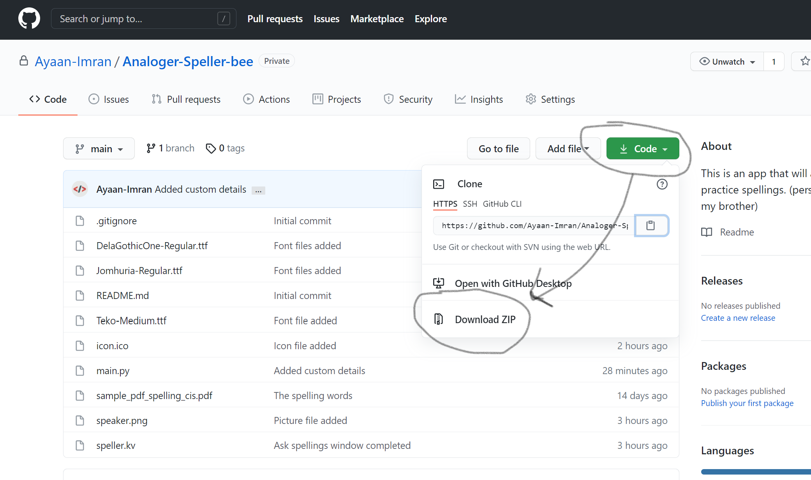

# Analoger speller bee
This is an app that will allow students from NBS to practice spellings.

## How to use it
### Step 1
Install python (3.6 or above)  

**To install python in linux:**  
```commandline
$ sudo apt install python3
```

**To Install linux in windows or mac**  
Go to [python's official download page](https://www.python.org/) and install it from there

### Step 2
Install git  
**To install git for linux**  
```commandline
$ sudo apt install git
```
**To install git for windows or mac**  
Go to [git's official download page](https://git-scm.com/downloads) and install git from there.
>If you don't want to install git then move on. But I would recommend installing git :)  

### Step 3
Clone this repository  
**This is multi-platform step, meaning it can work on mac, windows and linux**  
1. Go to your preferred terminal
2. `$ git clone https://github.com/Ayaan-Imran/Analoger-Speller-bee.git`  
**If you skipped installing git**  
Download this repository's zip file and unzip it.  


### Step 4
Using pip, install these libraries. Pip is automatically installed when you install python:  
```commandline
$ pip install kivy
$ pip install pyttsx3
$ pip install PyPDF2
```
or you could `$ cd Analoger-Speller-bee`. Basically navigate in the cloned or downloaded repository. After that, run this command:
```commandline
$ pip install -r requirements.txt
```

### Step 5
Run the main.py file and enjoy it!  
**For linux and mac**
```commandline
$ python3 main.py
```
**For windows**
```commandline
$ python main.py
```


## Contact me
My email: miskiacuberayaan2509@gmail.com  
My github: https://github.com/Ayaan-Imran  
My pypi: https://pypi.org/user/Coder_boy_2509/  